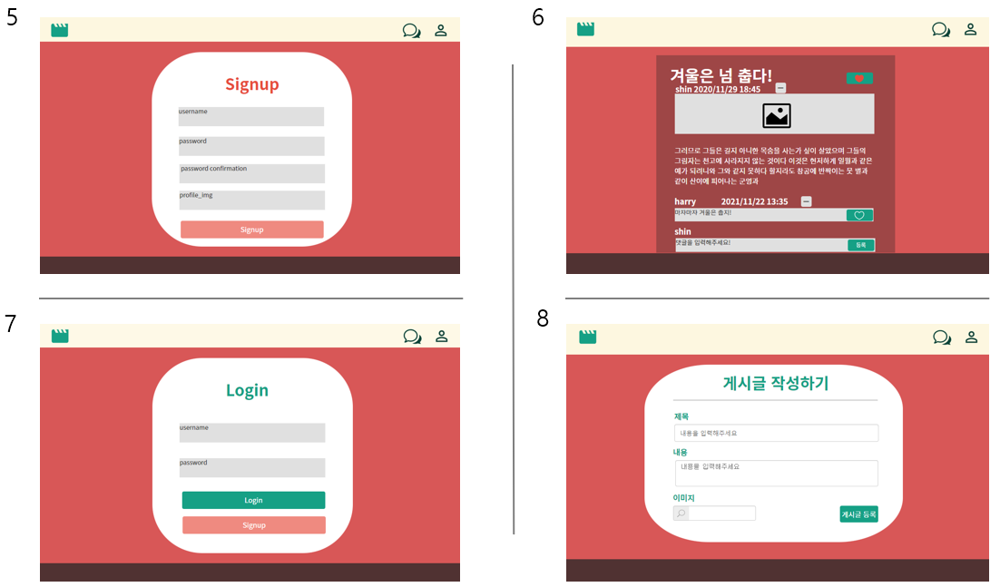
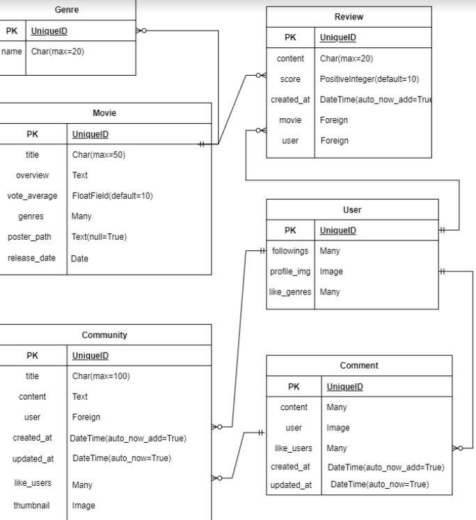
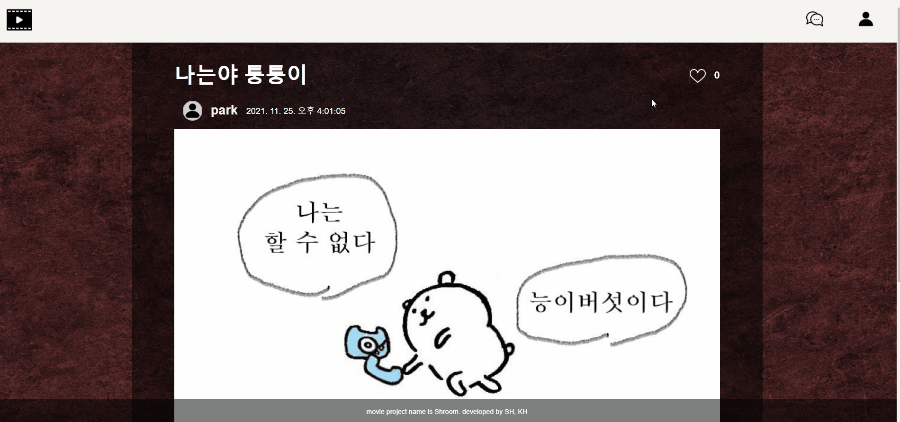
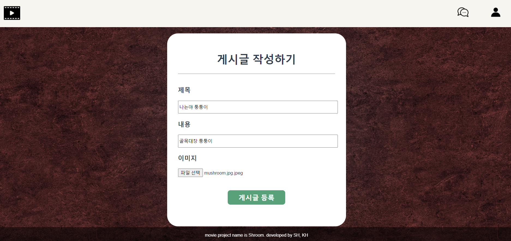
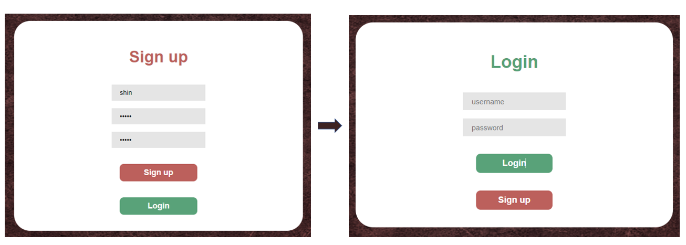
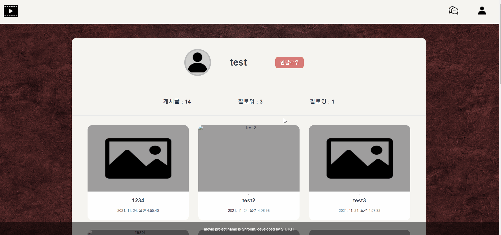

## 🥕능이버섯팀의 FINAL PROJECT(박신영, 임경훈)🥕

### PROJECT NAME: SHROOM

### [개요]

- 프로젝트의 목적 
- 팀원 정보 및 업무 분담 내역 + 느낀점
- 개발환경
- 목표 및 구현 정도
- 데이터베이스 모델링 
- 기능 설명  - movies/ community/ accounts

  

---

### 1. 프로젝트의 목적🌴

1. vue와 django 활용을 통한 실력 향상 
2. 협업 능력 향상

---

### 2. 팀원 정보 및 업무 분담 내역 + 느낀점  

#### 🥤 박신영: 기능 구현을 위한 백엔드, 상세 디자인

>  처음으로 하루를 초과한 긴 프로젝트를 경험했다. 여태껏 배웠던 것을 합치고 활용하는 것인데 생각보다 쉽지 않았다. 그래도 2학기를 미리 경험한 것 같아 좋았다. 취업 생각이 전혀 없었지만 2학기를 생각하니 갑자기 취업이 하고 싶다. 🥃 
>
>  무엇을 하던 계획이 제일 중요하다고 생각한다. 하지만 어디서 나타날지 모르는 에러 덕분에 프로젝트에서는 계획을 지키기가 쉽지 않았다. 그래서 다음 프로젝트 때에는 아주 현실적이고 구체적으로 기획을 해야겠다. 
>
>  장고와 뷰를 따로 작성했다. 요 부분이 아쉽다. 다음엔 장고와 뷰의 속도를 맞춰야지. 
>
>  처음 영화 API를 활용하여 정보를 가져오는 부분이 매우 까다로웠다. 사실 페어인 경훈님의 지분 100%이다. 감사함둥
>
>  아직 갈 길이 매우 멀다. 앞으로 더 잘할 수 있을까 살짝 걱정도 됐고, 7일간의 시간 동안 참 많은 생각이 들었다.  그리고 7일간 함께한 페어 경훈님 고생많으셨고 고마워요~~!
>
>  만들고 나서 보니 꽤나 완성도가 높다. 그것은 페어 덕분이라고 생각한다. 껄껄🍀

#### 🍭임경훈:  vue를 사용한 프론트, 영화 API

> 이렇게 오랫동안 책상앞에 앉아 있었던 적이 또 언제였나 싶다. 정말 말 그대로 하루종일 앉아서 프로젝트를 작성 하는 데 시간은 신기하게도 잘 간다. 시간을 투자한 만큼의 아웃풋이 나오는 것 같진 않은데... 하루만 더 있었으면 하는 바람이 정말 크다.
>
> 결국에는 100% 하고싶었던 설계대로 하지 못했다. 분명 배운 것을 쓰는 것인데 말이다.. 그래도 프로젝트를 하는 한 주동안 정말 재미있었다. 싸피에 들어올 때 면접에서도 내가 무언가를 창조할 수 있는 개발자가 좋다고 했다. 그 말은 정말로 거짓이 아니었나보다. 
>
> 부족한 점이 많고 또 성격도 모나있는데 나랑 페어해주고 또 고생해준 신영님에게 정말 감사하다는 말도 전하고 싶다.
>
> 고생하셨어요. 후회... 안하시죠..?

---

### 3. 개발 환경

> 협업 툴: Notion, MatterMost
>
> 디자인: Ovenapp
>
> erd: draw.io
>
> FRONT: VUE.js 2, JAVASCRIPT, HTML, CSS
>
> BACK: DJANGO, PYTHON 3.9.6
>
> DATABASE: sqlite3

---

### 4. 목표 및 구현 정도

목표: 베이지, 레드, 그린 삼색을 활용한 깔끔한 영화 추천 사이트 

> 11/17-11/22 : 프론트, 백 1차 마무리 (모든 기능 구현)
>
> 11/23/11/24: 디자인
>
> 11/25: 최종 마무리 및 발표 준비 
>
> 
>
> 1. 영화 메인 페이지 -> 2. 사용자 프로필 -> 3. 단일 영화 상세 페이지 -> 4.게시글 조회 페이지 
>
> 
>
> 5. 회원가입 -> 6. 단일 게시글 조회 페이지 -> 7. 로그인 -> 8. 게시글 작성 
>
> 상단의 사진과 같이 제작하고자 함. 

구현 정도:

> accounts: 로그인, 로그아웃, 회원가입, 프로필 조회, 팔로우, 좋아요 기능 
>
> movies: 좋아하는 영화 선택 후 해당 장르의 영화를 추천, 평점 순 추천, 최신 개봉순 추천
>
> community: 게시글 조회, 게시글 작성, 게시글에 대한 댓글 등록 기능 

---

###  5. 데이터베이스 모델링

> 
>
> 프로젝트 기획에 있어서 아주 중요한 요소 중 하나는 바로 ERD!! 
>
> 위와 같은 내용으로 이미 관통프로젝트를 진행해봤기 때문에 꽤나 수월했다.
>
> 1. 영화 entity에서 영화에 쓴 댓글인 review와 영화의 장르인 genre를 참조한다. 
>
>    (필드: 제목, 줄거리, 평점, 장르, 포스터 이미지 경로, 개봉일)
>
> 2. 사용자  entity는 팔로우, 프로필 이미지, 좋아하는 장르에 대한 정보를 담고있다.
>
> 3. 게시판 entity는 게시판에 달린 댓글과 게시글 작성자와 좋아요를 누른 사람을 참조한다.
>
>    (필드: 제목, 내용, 사용자, 작성일, 수정일, 해당 게시글을 좋아하는 유저, 썸네일 사진)

---

### 6. 기능 설명 

#### 🧁 nav-bar

> 🎞: 좌측의 영화 아이콘은 영화를 추천해주는 메인 페이지를 확인할 수 있다.
>
> 💬: 우측의 채팅 아이콘을 클릭하면 게시글을 공유하는 community 페이지를 확인할 수 있다. 
>
> 👨: 우측의 사람 아이콘을 클릭하면 '나의 프로필'을 확인할 수 있다.

#### 🧁 movies

1. 관심있는 영화 선택 후 비슷한 장르의 영화 추천 제공 

   > 
   >
   > 
   >
   > 1. 해당 영화 포스터에 마우스를 올리면 영화의 제목과 줄거리를 확인할 수 있다. 
   >
   > 2. 영화 포스터를 클릭함으로써 관심있는 영화를 선택할 수 있다. 영화를 클릭하면 checked라고 표시된다.
   > 3. 영화 선택이 끝난 후 send 버튼을 클릭하면  해당 영화와 같은 장르의 영화를 추천해준다. 

   

2. 영화 추천 알고리즘 3가지

   > 
   >
   > 
   >
   > 1. 선택한 영화와 같은 장르의 영화를 평점 순으로 추천한다.
   > 2. 버튼을 한번 클릭하면 최신 개봉 영화를 평점 순으로 추천한다.
   > 3. 버튼을 한번 더 클릭하면 평점순으로 영화를 추천한다. 

   

3. 영화 상세 페이지

   > 
   >
   > 
   >
   > 1. 해당 영화를 클릭하면 상세 페이지로 이동한다.
   > 2. 영화 포스터를 클릭하면 영화 상세 내용 확인이 가능하다. 
   > 3. 리뷰 작성 기능이 있다. 평점과 한줄평을 등록할 수 있으며 등록한 평점은 전체 평점에 반영된다. 
   
   
   
   

#### 🧁 community

1. 게시글 전체 조회

   > 
   >
   > 
   >
   > 1. 네비게이션 바에서 채팅 아이콘을 클릭하면 전체 게시글을 조회할 수 있다.
   > 2. 게시글을 클릭하면 상세 페이지로 이동한다. 
   > 3. 생각 공유하기 버튼을 클릭하여 게시글 작성이 가능하다. 

   

2. 게시글 상세 페이지 조회

   > 
   >
   > 
   >
   > 1. 게시글의 좋아요 기능이 있다.
   > 2. 게시글 하단에 댓글 등록이 가능하다.
   > 3. 게시글 작성자 이름을 클릭하면 해당 사용자의 프로필로 이동한다. 

   

3. 게시글 작성

   > 
   >
   > 
   >
   > 1. 사진 등록 또한 가능하다. 

#### 🧁 accounts

1. signup & login

   > 
   >
   > 
   >
   > 1. 회원가입 후 자동으로 로그인 페이지로 이동한다. 

   

2. 나의 프로필

   > 
   >
   > 
   >
   > 1. 네이게이션 우측의 사람 아이콘을 클릭하면 나의 프로필 확인이 가능하다. 
   > 2. 내가 작성한 게시글 및 리뷰 확인이 가능하며 게시글 또는 리뷰를 클릭하면 상세 페이지로 이동한다. 

   

3. 사용자 프로필 

   > 
   >
   > 
   >
   > 1. 게시글에서 작성자 이름을 클릭하면 해당 사용자의 프로필로 이동한다.
   > 2. 사용자가 작성한 게시글 확인이 가능하다.
   > 3. 게시글을 클릭하면 상세 페이지로 이동한다. 
   > 4. 팔로워 및 팔로잉을 클릭하여 팔로워 목록과 팔로잉 목록 확인이 가능하다. 

### 🌼봐주셔서 감사함당~🌼
